# Python_Programming

# Question 1 
Given an array of integers, find two numbers in it such that they can add up to a specific number.
You may assume there are exactly one solution, you can’t use the same element twice. 

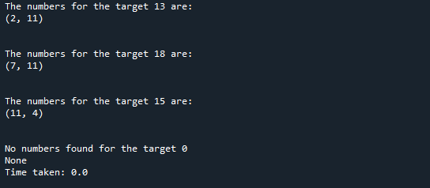

# Question 2 
Given a binary tree, find the max depth of it. 
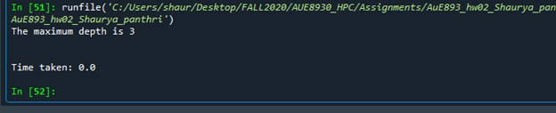

# Question 3 
You are given two non-empty linked lists representing two non-negative integers. The digits are stored in reverse order and each of their nodes contain a single digit. Add the two numbers and return it as a linked list.
You may assume the two numbers do not contain any leading zero, except the number 0 itself.
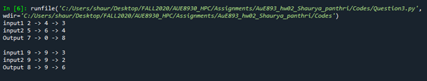

# Question 4 
Given a string s, find the length of the longest substring without repeating characters. You can expect the string length is less than 100, and only contains English letters.

# Question 5 
Write a NumPy program to add, subtract, multiply, divide arguments element-wise.
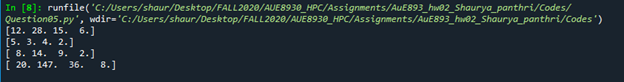
# Question 6 
Use OpenCV to do a bilateral filter to an image, modify from question6.py, you may use your favorite image, visualize the images before and after the filtering using matplotlib.

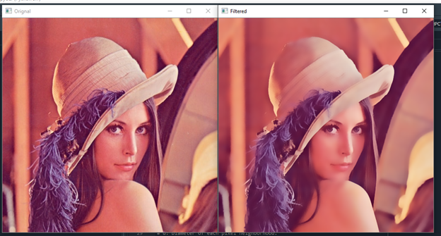

# Question 7 
Given a binary tree and a sum, determine if the tree has a root-to-leaf path such that adding up all the values along the path equals the given sum.
Note: A leaf is a node with no children.
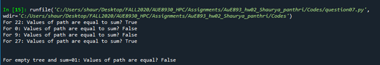

# Question 8 
Use SciPy for an application of Discrete Fourier Transform (DFT), modify the question8.py, and apply DFT to the array “a” and visualize both original and result signals.
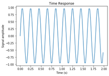 
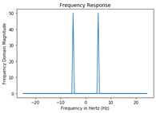 

# Question 9 
Given an integer array nums, find the contiguous subarray (containing at least one number) which has the largest sum and return its sum.
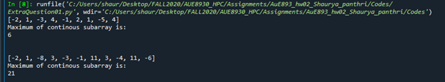

# Question 10 
You are given an array of k linked-lists lists, each linked-list is sorted in ascending order.
Merge all the linked-lists into one sorted linked-list and return it.
 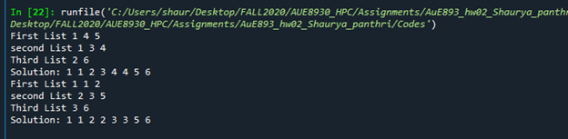

# Question 11 
Write a NumPy program to get the values and indices of the elements that are bigger than 10 in a given array.
Modify the extra_question3.py
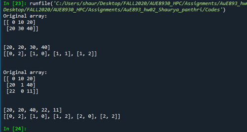

# Question 12 
Use template matching with OpenCV to find Messi’s face in an image, try all 6 methods and plot the result.
Modify the extra_question5/code.py
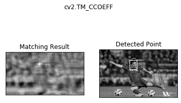
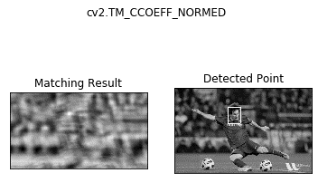
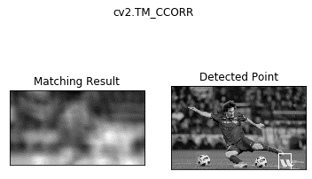
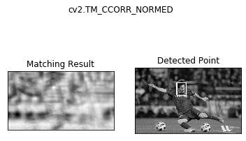
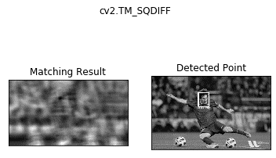

# License
Copyright (C) 2020 Shaurya Panthri.

This program is free software: you can redistribute it and/or modify it under the terms of the GNU General Public License as published by the Free Software Foundation, either version 3 of the License, or (at your option) any later version.

This program is distributed in the hope that it will be useful, but WITHOUT ANY WARRANTY; without even the implied warranty of MERCHANTABILITY or FITNESS FOR A PARTICULAR PURPOSE. See the GNU General Public License for more details.

You should have received a copy of the GNU General Public License along with this program. If not, see http://www.gnu.org/licenses/

